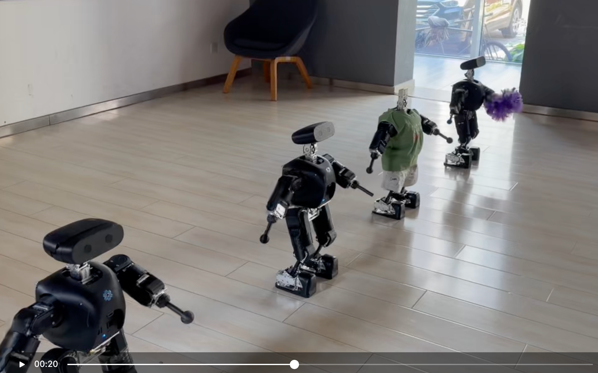
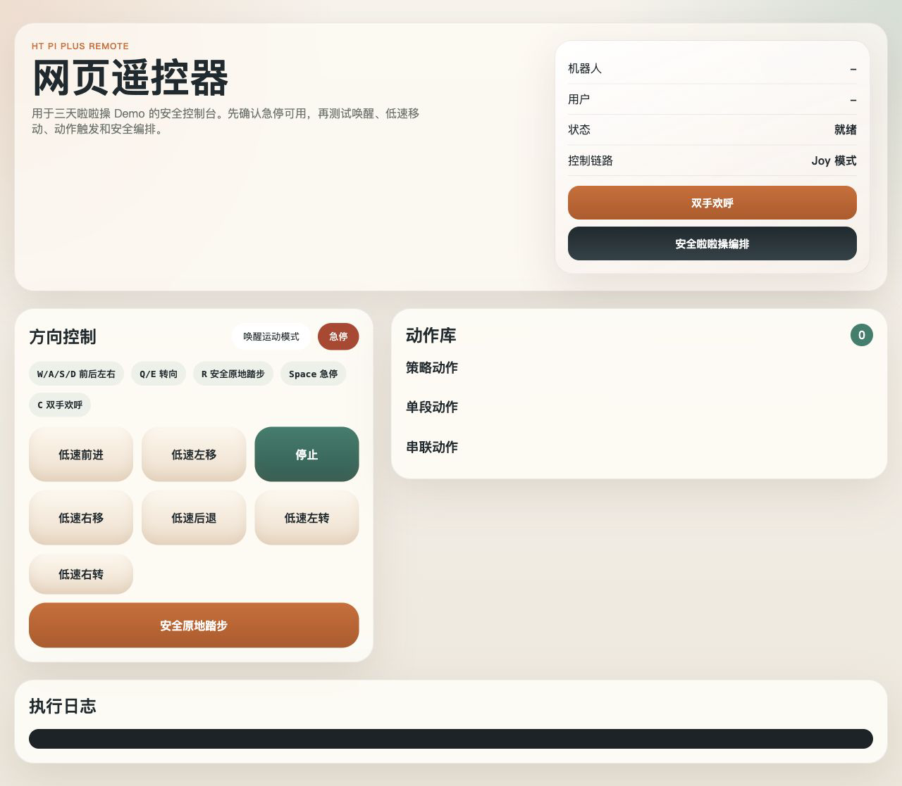
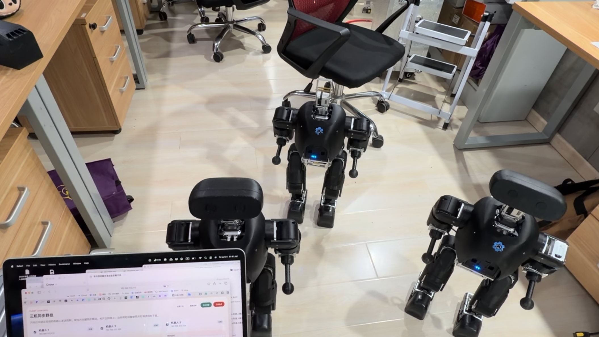

# HT Pi Plus LalaDance

HT Pi Plus / Mini Pi Plus 啦啦操演示项目，包含多机器人动作资源、网页遥控器和可部署到机器人本机的控制 Agent。



## 可视化控制台

网页控制台提供低速移动、急停、唤醒、原地踏步、双手欢呼和动作库触发。它通过 ROS 的 `/joy_input` 接口模拟手柄输入，避免直接控制单个电机。



### 机器人端运行

将 `robot_remote_web/robot_agent` 部署至机器人后，在机器人上启动：

```bash
cd /home/hightorque/robot_remote_web_agent/robot_agent
bash start_robot_agent.sh
```

浏览器访问 `http://<robot-ip>:8766`。默认机器人地址在 `robot_remote_web/robot_agent/config.robot.json` 中配置。

### PC 端运行

```bash
cd robot_remote_web
bash start_remote.sh
```

浏览器访问 `http://127.0.0.1:8765`。详见 [网页遥控器说明](robot_remote_web/README.md)。

## 项目内容

- `robot_remote_web/`：PC 端网页遥控器、机器人端 Web Agent 和部署脚本。
- `robot_action_config/`：啦啦操动作、动作配置及转换工具。
- `HT_Pi_Plus_demo_runbook.md`：现场演示操作手册。
- `docs/`：机器人演示照片和可视化控制台截图。


